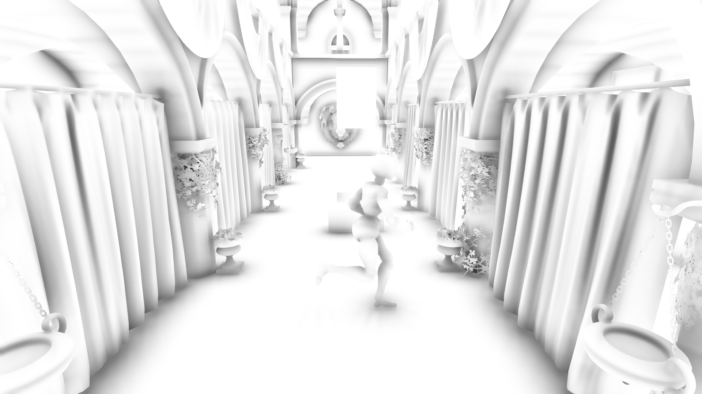

# Mirai Engine

A modern C++ Vulkan-based game engine built for learning and experimenting with advanced rendering techniques. 

**Current Features:**
- Physically Based Rendering (PBR)
- Concurrent Binary Tree (CBT) dynamic terrain generation
- Horizon-Based Ambient Occlusion (HBAO)
- Skeletal animation
- Tiled Light Culling
- Cascaded Shadow Maps
- TAA [WIP]
- GPU Raytracing [WIP]
## Installation

1. Clone the repository
```bash
git clone --recursive https://github.com/Itachi546/MiraiEngine.git
```

2. Make a build directory
```bash
mkdir build
```

3. Generate a project
```bash
cd build && cmake .
```

## Gallery & Features

Here are some showcases of Mirai Engine's rendering capabilities:

| | |
|:---:|:---:|
|  <br> **Bistro Scene** <br> *PBR rendering with environment mapping and ray-traced directional shadows.* |  <br> **Skeletal Animation** <br> *Support for skinned meshes and dynamic skeletal animations.* |
|  <br> **HBAO** <br> *Horizon Based Ambient Occlusion for realistic soft contact shadows.* |  <br> **PBR Materials** <br> *Physically Based Rendering pipeline demonstrated on Damaged Helmet.* |
|  <br> **CBT Terrain** <br> *Concurrent Binary Tree based dynamic terrain rendering.* |  <br> **Terrain Wireframe** <br> *CBT LOD wireframe visualization.* |
|  <br> **Frozen LODs** <br> *CBT terrain generation with frozen level of details.* |  <br> **Sponza Scene** <br> *Classic Sponza Scene rendering.* |
