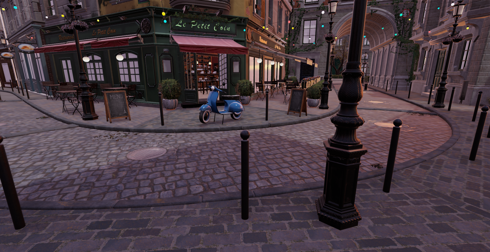
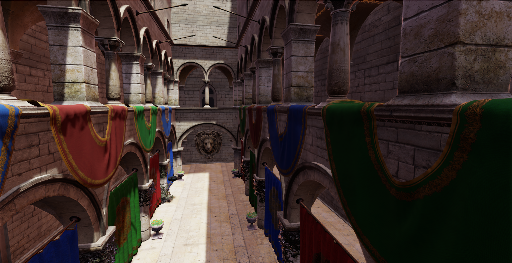
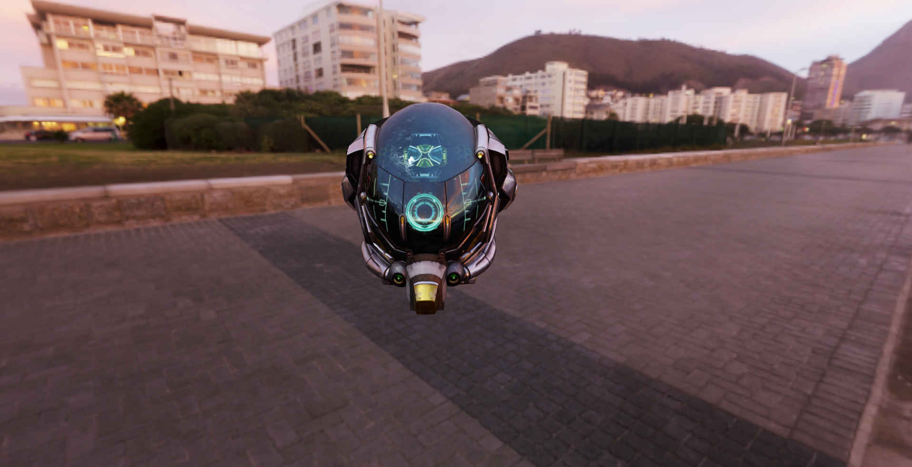
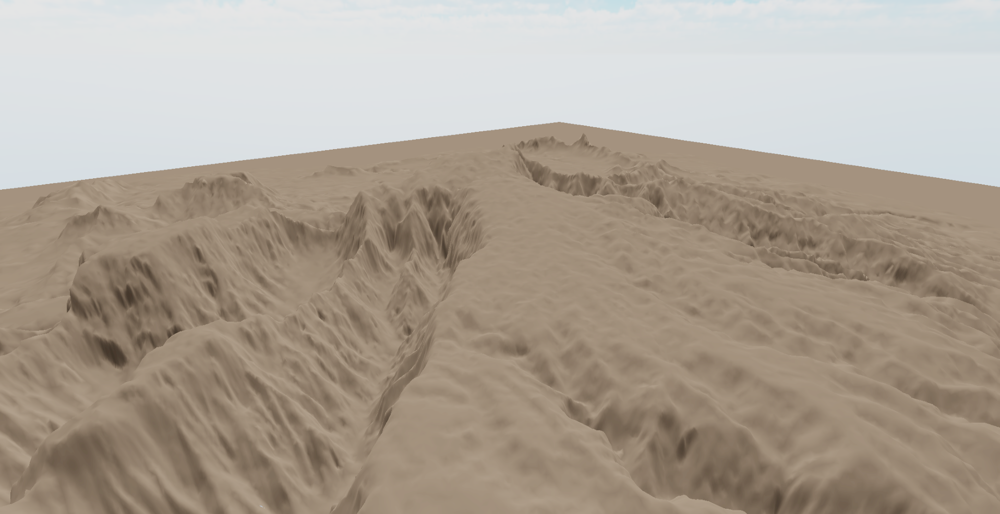
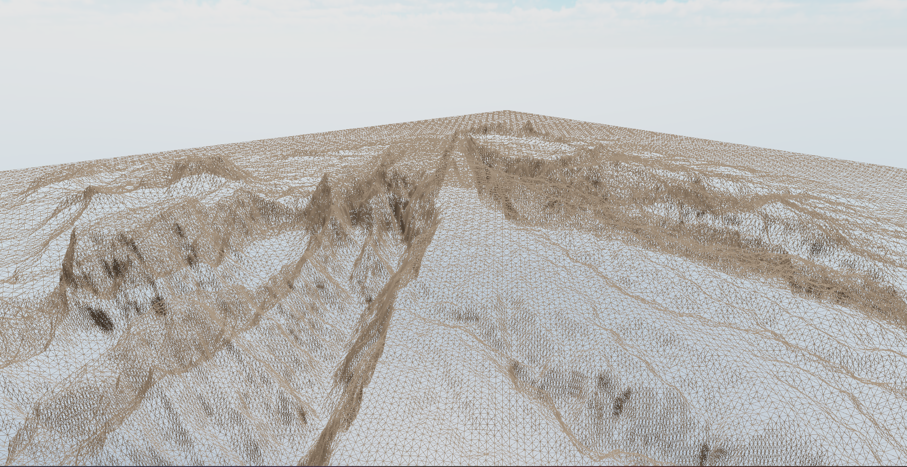
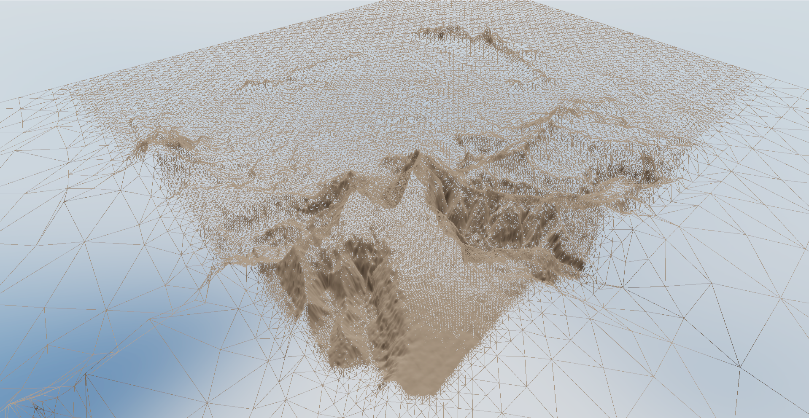

# Mirai Engine

A C++ Vulkan-based game engine for learning rendering.

## Installation

1. Clone the repository
```bash
   git clone --recursive https://github.com/Itachi546/MiraiEngine.git
```

2. Make a build directory
```bash
   mkdir build
```

3. Generate a project
```bash
   cd build && cmake .
```

## Screenshots


*PBR rendering of Bistro with environment mapping and ray traced directional shadow*


*Sponza Scene*


*DamagedHelmet*

 
*CBT Based Terrain*


*CBT Based Terrain Wireframe*


*CBT Based Terrain Generation Freezed*

